# grocket使用指南 #

## step1.切换到grocket\win32_vc2010目录下 ##

## 执行命令 ##
> grtool create_module -name caoxinyu -dir ./caoxinyu -tcp_port 8000

忘记了可以
> grtool -help

## step2导入到vs ##

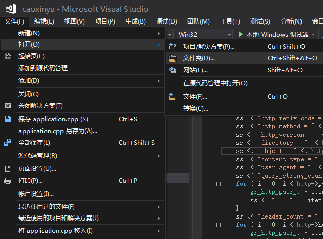

## step3 点击make/vc/*.sln ,就会把当前目录变成solution##

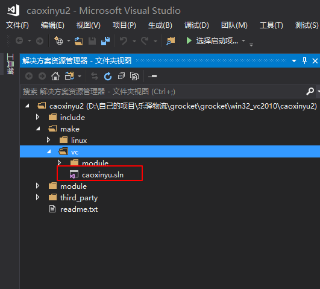

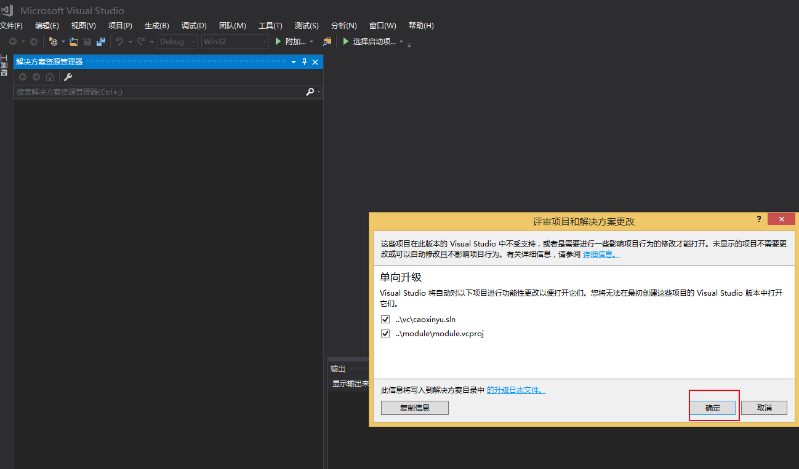

## step4 可能会告诉你windows sdk 不会，这时候，你调整一下就可以了。##

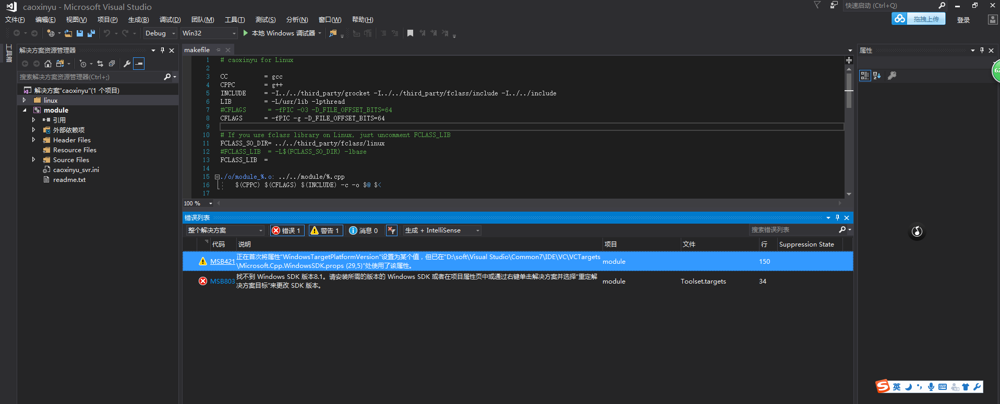

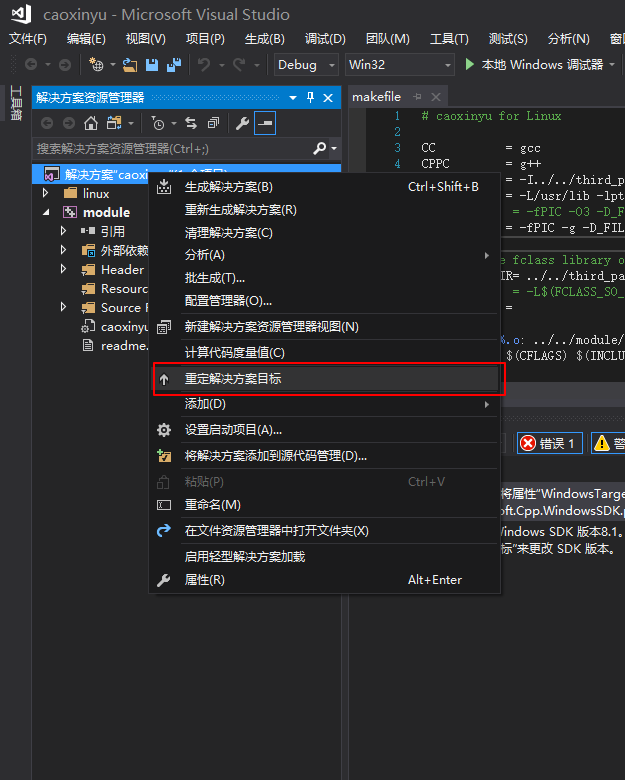

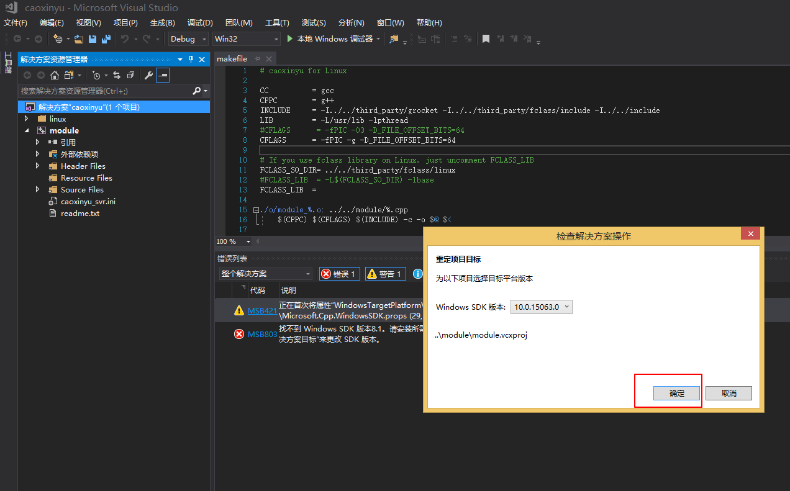

## 调试运行 ##
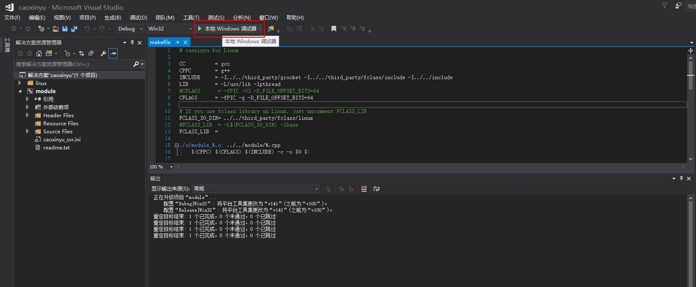

### 可能会报错 ###

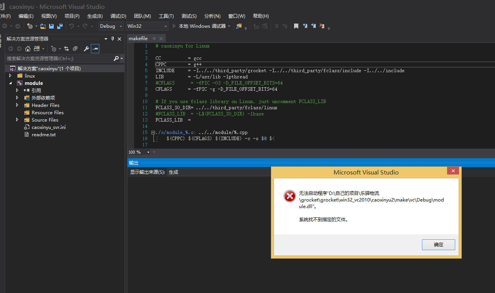

## 解决方法 ##
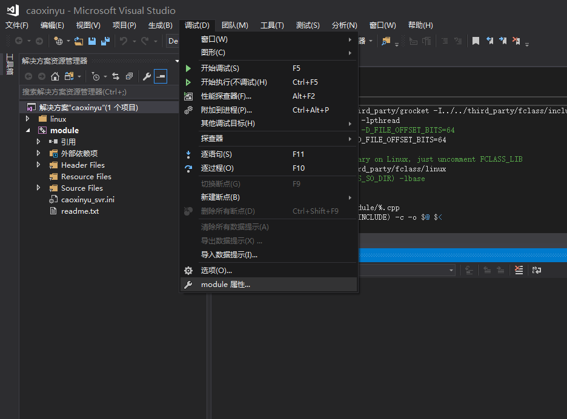

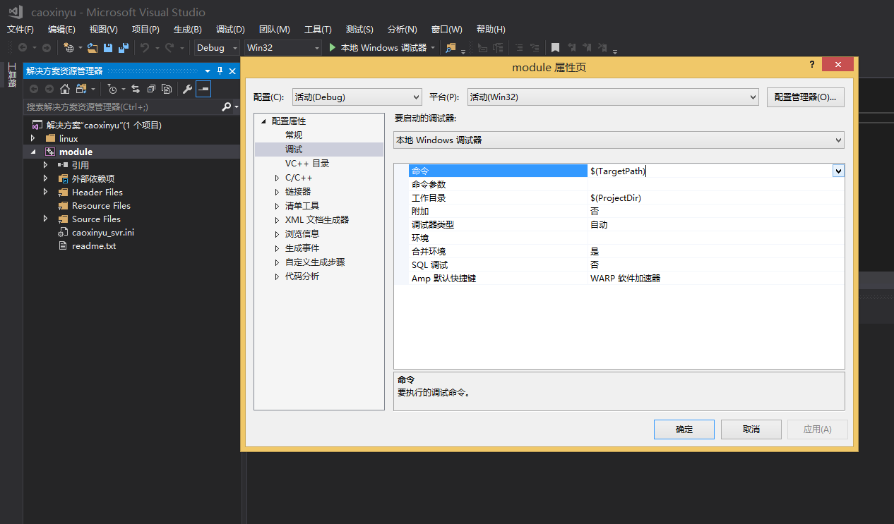

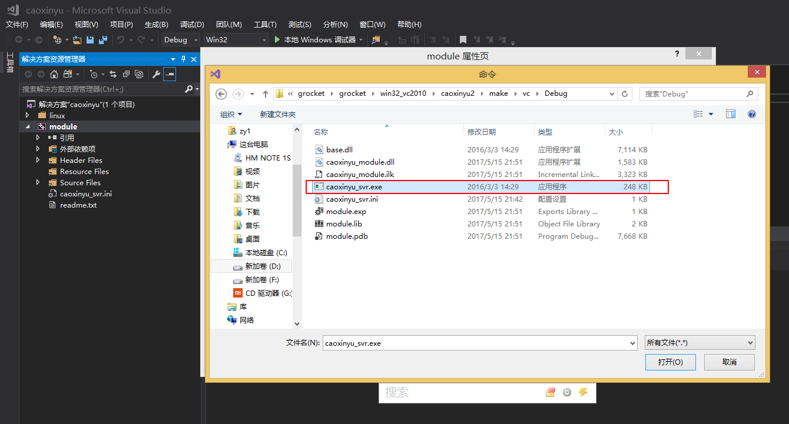

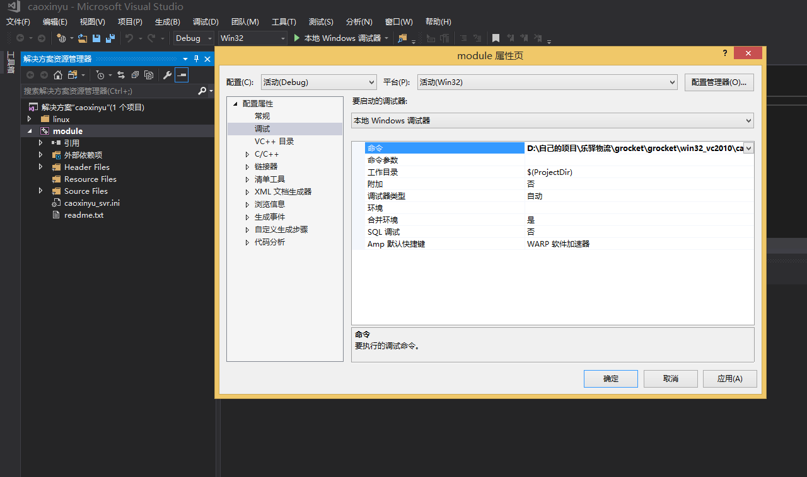

然后应用，确定就可以运行了。

